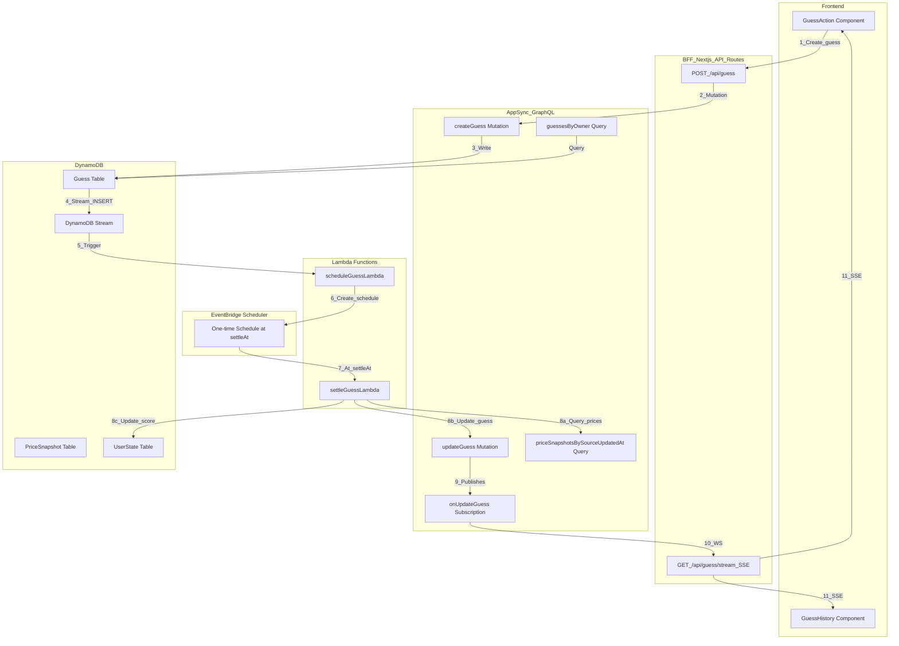
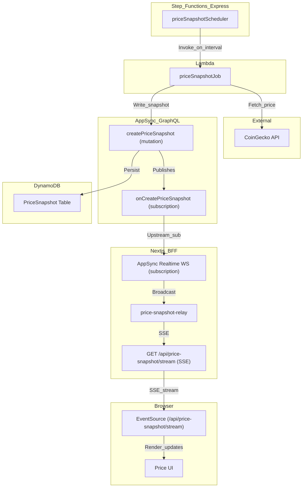

# Architecture & Amplify Backend Layout

This document is the **high-level architecture reference** for the two core backend flows:
- **Guess settlement** (one-shot schedule per guess)
- **Price snapshot ingestion + realtime fanout**

It also explains what exists under `amplify/` and why.

### Guess settlement (backend) — architecture diagram

### Guess settlement — snapshot resolution rule

Settlement relies on `PriceSnapshot.sourceUpdatedAt` (CoinGecko’s timestamp) for determinism.

- For `createdAt`: pick the **latest** snapshot where `sourceUpdatedAt <= createdAt`
- For `settleAt`: pick the **latest** snapshot where `sourceUpdatedAt <= settleAt`

This is implemented in `amplify/backend/function/settleGuessLambda/src/index.js` by querying `priceSnapshotsBySourceUpdatedAt` with `sortDirection: DESC` and `sourceUpdatedAt: { le: <timestamp> }`, `limit: 1`.

---

### Price snapshot ingestion + realtime updates — architecture diagram

---

### Amplify backend setup — what exists and what it’s for

This project uses **Amplify Gen1** (CloudFormation-based). The backend lives under `amplify/backend/`.

- **`amplify/backend/api/epilot/`**: AppSync + DynamoDB (Amplify GraphQL transformer)
  - **`schema.graphql`**: source schema (`@model`, `@auth`, `@index`), including `Guess`, `PriceSnapshot`, `UserState`
  - **`transform.conf.json`**: transformer config; enables **DynamoDB Streams** for `Guess` (NEW_IMAGE) so `scheduleGuessLambda` can be triggered
  - **`build/schema.graphql`**: compiled schema output (generated by Amplify; source of truth for Codegen)

- **`amplify/backend/function/`**: Lambda functions
  - **`priceSnapshotJob/`**: fetches CoinGecko price and writes `PriceSnapshot` via AppSync (API key auth)
  - **`scheduleGuessLambda/`**: triggered by **Guess DynamoDB Stream INSERT**, creates **EventBridge Scheduler** one-shot schedule (idempotent by schedule name)
  - **`settleGuessLambda/`**: invoked by EventBridge Scheduler at `settleAt`, resolves snapshots, updates `Guess` (SETTLED/FAILED), updates `UserState.score`
  - **`epilotAuthPostConfirmation/`**: Cognito post-confirm trigger that creates `UserState` for a new user

- **`amplify/backend/custom/`**: custom CloudFormation stacks (Amplify “custom resources”)
  - **`priceSnapshotScheduler/`**: provisions the Step Functions scheduler used by `priceSnapshotJob`
  - **`guessSettlementScheduler/`**: provisions EventBridge Scheduler resources:
    - Schedule group `guess-settlements`
    - IAM role used by Scheduler to invoke `settleGuessLambda`

- **`amplify/backend/backend-config.json`**: Amplify’s wiring/metadata
  - Declares functions/custom stacks
  - Declares dependencies (`scheduleGuessLambda` depends on the settle lambda ARN + scheduler role ARN + GraphQL API id output to import the Guess table stream ARN)

- **Testing under Amplify**
  - **Unit tests**: `amplify/backend/function/*/src/__tests__/*.unit.test.js`
  - **AWS integration smoke tests**: `amplify/backend/__tests__/integration/*.int.test.ts` (real AWS calls; validate wiring + permissions)

### Related docs

- **Developer bootstrap**: `SETUP.MD`
- **BFF + query + SSE relay pattern**: `FETCHING.md`
- **Test strategy + how to run integration tests**: `TESTING.md`

