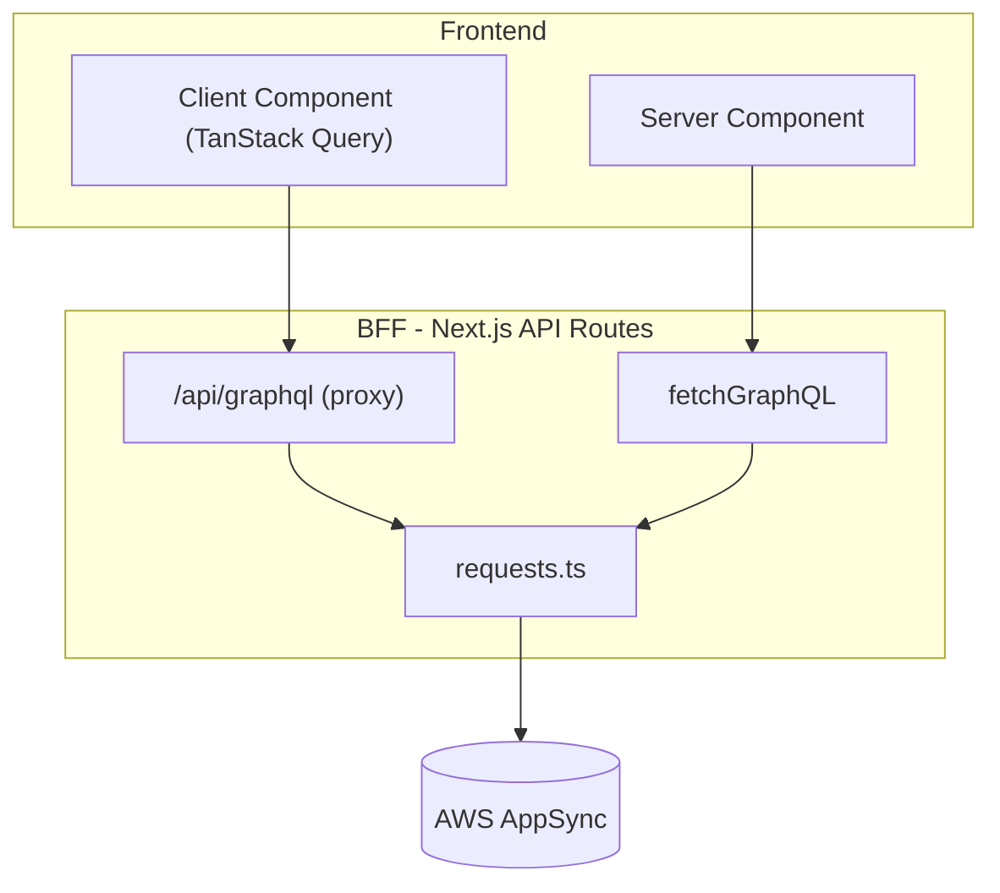

# Data Fetching Architecture

This document describes the data fetching setup for the bigbet application.

## Overview

All data fetching flows through a **Backend-for-Frontend (BFF)** pattern. The frontend never communicates directly with AWS AppSync - all requests go through Next.js API routes which handle authentication and forward requests to AppSync.



## GraphQL Type Generation

Types are automatically generated from the AppSync schema using GraphQL Codegen.

### Schema Sources

- **AppSync build schema**: `amplify/backend/api/bigbet/build/schema.graphql`
  - Auto-generated by Amplify from your `schema.graphql` with `@model`, `@auth` directives
  - Contains all CRUD operations, inputs, connections, etc.
- **AWS Scalars**: `src/graphql/aws-scalars.graphql`
  - Defines AWS-specific scalar types (AWSDateTime, AWSEmail, etc.)

### Query Documents

GraphQL query files (`.graphql`) are **collocated** with the code that uses them:

```
src/app/api/price-snapshot/
├── queries.graphql    ← query definitions
└── stream/
    └── route.ts       ← uses the queries
```

### Generated Output

Types are generated to `src/graphql/generated/`:

```
src/graphql/generated/
├── graphql.ts         ← types, enums, and typed documents
├── gql.ts             ← graphql() tagged template helper
├── fragment-masking.ts
└── index.ts
```

### Commands

| Command                | Description                                      |
| ---------------------- | ------------------------------------------------ |
| `pnpm codegen`         | Generate types from schema and query documents   |
| `pnpm amplify:compile` | Compile Amplify schema + run codegen (no deploy) |
| `pnpm amplify:push`    | Deploy to AWS + run codegen                      |

### Workflow

1. Edit your source schema at `amplify/backend/api/bigbet/schema.graphql`
2. Run `pnpm amplify:compile` to generate the build schema
3. Add/edit `.graphql` query files next to your code
4. Run `pnpm codegen` to regenerate types
5. Import typed documents and types from `@/graphql/generated/graphql`

## Frontend Queries

All frontend queries go through the BFF via the `/api/graphql` proxy endpoint.

### Setup

The app is wrapped with `QueryProvider` (TanStack Query) in the root layout:

```tsx
// src/app/layout.tsx
<QueryProvider>
  <NextIntlClientProvider>{children}</NextIntlClientProvider>
</QueryProvider>
```

### Client-Side Fetching

Use `fetchGraphQLClient` from `@/lib/requests-client`:

```tsx
import { graphql } from '@/graphql/generated/gql'
import { fetchGraphQLClient } from '@/lib/requests-client'

const GetUserStateQuery = graphql(`
  query GetUserState($pk: String!) {
    getUserState(pk: $pk) {
      pk
      email
      score
    }
  }
`)

// In a client component
const data = await fetchGraphQLClient(GetUserStateQuery, { pk: userId })
// data is fully typed as GetUserStateQuery
```

### With TanStack Query

For React hooks with caching, use TanStack Query directly:

```tsx
import { useQuery } from '@tanstack/react-query'
import { PriceSnapshotsByPkDocument } from '@/graphql/generated/graphql'
import { fetchGraphQLClient } from '@/lib/requests-client'

function MyComponent() {
  const { data, isLoading, error } = useQuery({
    queryKey: ['priceSnapshots', pk],
    queryFn: () => fetchGraphQLClient(PriceSnapshotsByPkDocument, { pk }),
  })
}
```

### How It Works

1. Client calls `fetchGraphQLClient(document, variables)`
2. Request is sent to `/api/graphql` with the query string and variables
3. BFF extracts the user's `idToken` from the NextAuth session
4. BFF forwards the request to AppSync with the auth token
5. Response is returned to the client

## Backend Queries

Server-side code (API routes, server components) can query AppSync directly using `fetchGraphQL`.

### Direct AppSync Calls

Use `fetchGraphQL` from `@/lib/requests` with typed documents:

```tsx
import { fetchGraphQL } from '@/lib/requests'
import {
  PriceSnapshotsByPkDocument,
  ModelSortDirection,
} from '@/graphql/generated/graphql'

const data = await fetchGraphQL({
  document: PriceSnapshotsByPkDocument,
  variables: {
    pk: 'PriceSnapshot',
    limit: 1,
    sortDirection: ModelSortDirection.Desc,
  },
  idToken, // from NextAuth session
})
// data is fully typed
```

### GraphQL Proxy Route

The `/api/graphql` route acts as a transparent proxy:

```tsx
// src/app/api/graphql/route.ts
import { fetchGraphQLProxy } from '@/lib/requests'

export async function POST(req: NextRequest) {
  const token = await getToken({ req })
  const { query, variables } = await req.json()

  const data = await fetchGraphQLProxy({
    query, // raw string from client
    variables,
    idToken: token.cognitoIdToken,
  })

  return NextResponse.json({ data })
}
```

### Server-Side Streaming (SSE)

For real-time data, the app uses **Server-Sent Events** where the BFF relays AppSync subscription events:

- Browser opens `EventSource('/api/price-snapshot/stream')`
- The Next.js BFF maintains a single upstream AppSync subscription (`onCreatePriceSnapshot`)
- Each new `PriceSnapshot` event is broadcast to all connected SSE clients

Key files:

- `src/app/api/price-snapshot/stream/route.ts` (SSE endpoint)
- `src/app/api/price-snapshot/stream/price-snapshot-relay.ts` (fan-out to connected clients)
- `src/app/api/price-snapshot/stream/appsync-realtime.ts` (AppSync realtime WebSocket client)
- `src/app/api/price-snapshot/subscriptions.graphql` (subscription document)

## Key Files

| File                              | Purpose                                                          |
| --------------------------------- | ---------------------------------------------------------------- |
| `src/lib/requests.ts`             | Server-side AppSync client (`fetchGraphQL`, `fetchGraphQLProxy`) |
| `src/lib/requests-client.ts`      | Client-side BFF client (`fetchGraphQLClient`)                    |
| `src/app/api/graphql/route.ts`    | GraphQL proxy endpoint                                           |
| `src/providers/QueryProvider.tsx` | TanStack Query provider                                          |
| `src/graphql/generated/`          | Generated types and documents                                    |
| `src/graphql/aws-scalars.graphql` | AWS scalar type definitions                                      |
| `codegen.ts`                      | GraphQL Codegen configuration                                    |

## Authentication Flow

1. User authenticates via NextAuth (Cognito provider)
2. NextAuth stores `cognitoIdToken` in the session JWT
3. BFF extracts `idToken` using `getToken()` from `next-auth/jwt`
4. `idToken` is passed in the `Authorization` header to AppSync
5. AppSync validates the token and applies `@auth` rules from the schema

## Adding New Queries

1. Create a `.graphql` file next to the code that uses it:

   ```graphql
   # src/app/api/my-feature/queries.graphql
   query GetMyData($id: ID!) {
     getMyData(id: $id) {
       id
       name
     }
   }
   ```

2. Run `pnpm codegen`

3. Import and use the generated document:

   ```tsx
   import { GetMyDataDocument } from '@/graphql/generated/graphql'
   import { fetchGraphQL } from '@/lib/requests'

   const data = await fetchGraphQL({
     document: GetMyDataDocument,
     variables: { id: '123' },
     idToken,
   })
   ```
